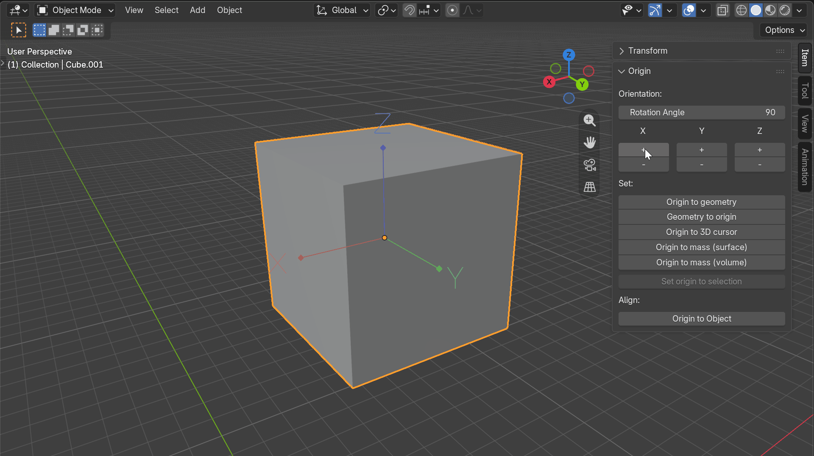
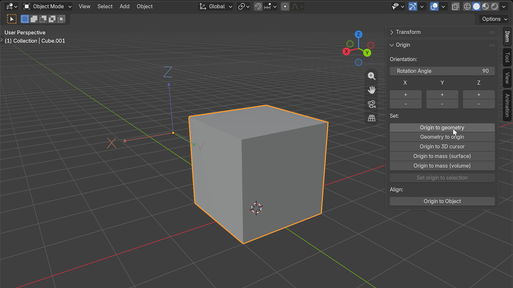
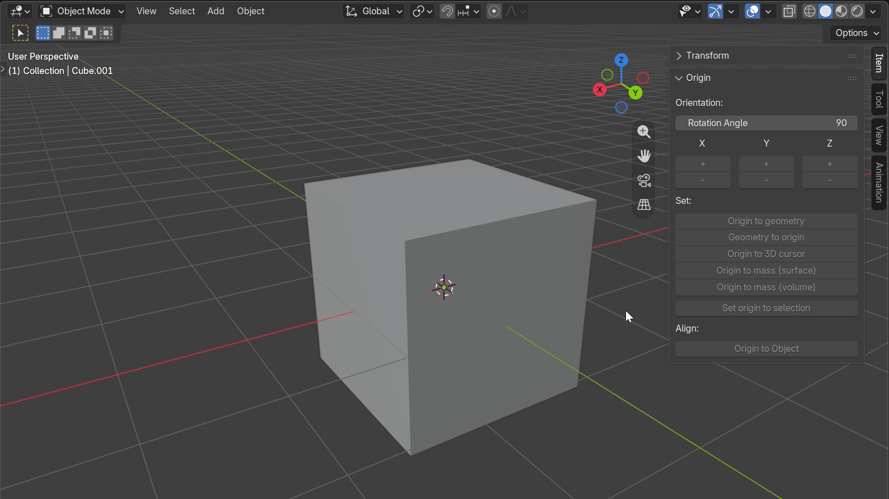

# Origin Tools

A powerful Blender add-on for efficiently manipulating object origins, aligning mesh geometry, and correcting coordinate axis orientation.

## About This Add-on

Origin Tools streamlines common origin-related tasks in Blender, making it easier to:
- Set object origins to specific locations (geometry, cursor, 3D cursor, center of mass)
- Reorient local axes without affecting world position
- Automatically align mesh geometry to correct axis orientation using RANSAC algorithm (experimental - currently supports Origin to Object, Object to Origin is planned)

Perfect for artists and modelers who frequently work with imported or procedurally generated meshes that may have incorrect origin placement or axis orientation.

## Installation

### From GitHub Release (Recommended)

1. Download the latest `.zip` file from the [Releases page](https://github.com/dmcoy/origin-tools/releases)
2. Open Blender and go to **Edit > Preferences > Add-ons**
3. Click the **"Install..."** button in the top-right corner
4. Navigate to and select the downloaded `.zip` file
5. The add-on will now appear enabled by default

### From Disk

1. Place the extracted `origin_tools/` folder in your Blender add-ons directory:
   - **Windows**: `%APPDATA%\Blender Foundation\Blender\<version>\scripts\addons\`
   - **macOS**: `~/Library/Application Support/Blender/<version>/scripts/addons/`
   - **Linux**: `~/.config/blender/<version>/scripts/addons/`
2. Restart Blender
3. Enable the add-on in **Preferences > Add-ons** (search for "Origin Tools")

## Usage

### Accessing the Panel

The Origin Tools panel is located in the 3D Viewport sidebar:
1. Press `N` to toggle the sidebar if it's not visible
2. Click on the **"Item"** category tab to reveal the Origin Tools panel

### Basic Requirements

- At least one object must be selected to use any operation
- The add-on works in both **Object Mode** and **Edit Mode** (except "Set origin to selection")
- For mesh alignment features, ensure your active object is a mesh type

## Features

### Change Origin Orientation

Rotate the local coordinate system of selected objects while preserving their world position and rotation. This can be useful for swapping origin axes around (e.g., swapping the Z for Y axis).

**Use Cases:**
- Converting between Z-up and Y-up coordinate systems (e.g., Maya to Blender)
- Adjusting axis orientation without losing object placement
- Correcting models imported from different software with conflicting conventions

**How It Works:**
- Select an object and ensure your desired rotation angle is set in the panel
- Click + or - for X, Y, or Z axes to rotate the origin accordingly
- The mesh geometry transforms inversely to maintain world alignment

---

### Set Origin Options

Quick access to Blender's built-in set origin commands via single-click operations.

These operators provide convenient shortcuts for the first five functions:

#### Origin to Geometry
Shortcut to **Object > Set Origin > Origin to Geometry**. 

#### Geometry to Origin  
Shortcut to **Object > Set Origin > Geometry to Origin**. 

#### Origin to 3D Cursor
Shortcut to **Object > Set Origin > Origin to 3D Cursor**. 

#### Origin to Mass (Surface)
Shortcut to **Object > Set Origin > Origin to Center of Mass + Volume (Surface)**.

#### Origin to Mass (Volume)  
Shortcut to **Object > Set Origin > Origin to Center of Mass + Volume (Volume)**.

These operations apply to all currently selected objects with a single click, providing quick access without navigating Blender's menu system.

---

### Origin to Selection

**Edit Mode Only**. This operator provides custom functionality that differs from Blender's default behavior. Unlike the other set origin operators, this sets the origin based on selected vertices in edit mode and automatically resets the 3D cursor to world origin after execution.

---

### Align Origin Tools

Automatically align mesh geometry with its dominant axis orientation using advanced RANSAC (Random Sample Consensus) algorithm for robust estimation.

> [!WARNING]
> This is an experimental feature and may not work effectively depending on the mesh's geometry. Results may vary based on mesh complexity, symmetry, and structure.

#### Origin to Object
Reorients the object's origin and local axes to match the dominant orientation of the mesh geometry. This is particularly useful for:
- Fixing models imported with incorrect axis orientation (e.g., X-up instead of Z-up)
- Correcting twisted or rotated meshes from CAD software
- Standardizing axis conventions across different modeling tools

**How It Works:**
1. The algorithm analyzes polygon normals and areas to determine the dominant axes
2. Uses RANSAC for robust outlier rejection (handles imperfect geometry well)
3. Applies rotation transformation to align with standard cardinal directions

---

## Requirements

- **Blender**: Version 4.2.0 or later

## License

This add-on is released under the **GNU General Public License v3.0 or later**.
See [LICENSE](LICENSE) for details.

### Important GPL Notice

When distributing modified versions of this add-on:
- You must include the complete source code
- You must retain all copyright notices and license text
- You must make the source available to recipients at no additional cost
- Consider releasing your modifications back to the community

## Support & Contributing

### Report Issues
Found a bug or have a feature request? Please open an issue on GitHub:
[https://github.com/dmcoy/origin-tools/issues](https://github.com/dmcoy/origin-tools/issues)

### Contributing
Contributions welcome! Feel free to submit pull requests for:
- Bug fixes
- New features (please discuss first in issues)
- Documentation improvements
- Code enhancements (following PEP8 style guidelines)

See the [GitHub repository](https://github.com/dmcoy/origin-tools) for more information.

## Credits

- Original mesh alignment algorithm adapted from [Auto-Align](https://github.com/cube-c/Auto-Align) (unlicensed reference material)
- Blender Foundation for the incredible open-source 3D creation suite

---

[GitHub Repository](https://github.com/dmcoy/origin-tools) | [Blender Extensions Platform](https://extensions.blender.org)